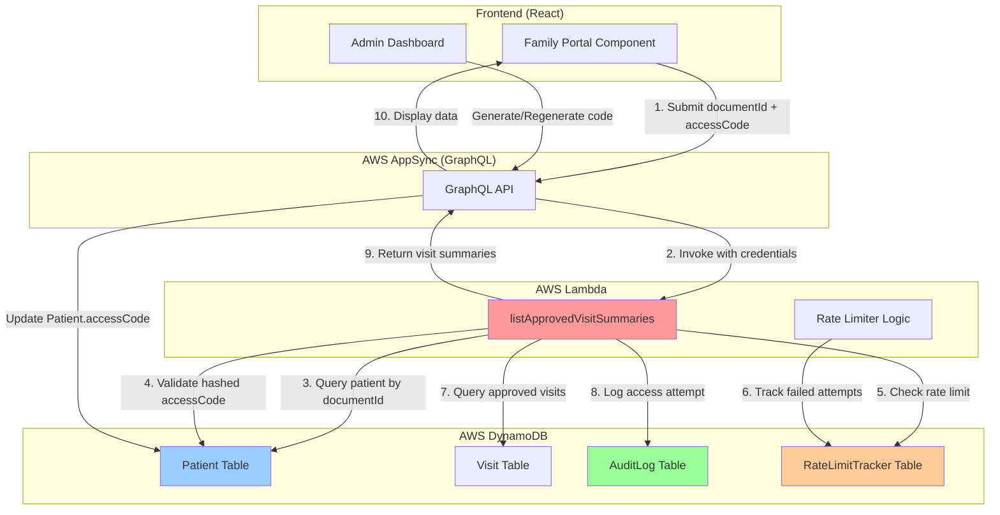

# Design Document: Family Portal Access Control

## Overview

The Family Portal Access Control feature implements a secure, server-side authentication mechanism for family members to access approved visit summaries. This design addresses the critical security vulnerability where the current system uses a hardcoded mock access code (1234) that provides no real protection.

The solution leverages existing infrastructure (Patient.accessCode field, listApprovedVisitSummaries Lambda) while adding cryptographic hashing, rate limiting, and comprehensive audit logging. The design prioritizes security without sacrificing usability for non-technical family members who will receive access codes via phone or SMS.

**Key Design Principles:**
- **Security First:** All validation happens server-side in Lambda functions
- **Minimal File Changes:** Modify existing Lambda, no new functions (keep file count low)
- **User-Friendly:** Simple 6-8 character codes, clear error messages in Spanish
- **Audit Everything:** Immutable logs for all access attempts (successful and failed)
- **Multi-Tenant Safe:** Strict tenantId isolation at all layers

## Architecture

### System Components



### Authentication Flow

1. **Family Member Input:** User enters patient document ID + access code in Family Portal
2. **GraphQL Request:** Frontend sends query to AppSync with both credentials
3. **Lambda Validation:** `listApprovedVisitSummaries` Lambda performs:
   - Rate limit check (IP-based)
   - Patient lookup by documentId + tenantId
   - Access code hash comparison
   - Multi-tenant isolation verification
4. **Audit Logging:** All attempts logged to AuditLog table (success or failure)
5. **Response:** If valid, return approved visits; if invalid, return generic error
6. **Session Management:** Frontend maintains 30-minute session with credentials

### Security Layers

1. **Server-Side Validation:** All authentication logic in Lambda (no client-side checks)
2. **Cryptographic Hashing:** Access codes hashed with bcrypt (cost factor 10)
3. **Rate Limiting:** 5 attempts per 15 minutes per IP address
4. **Audit Trail:** Immutable logs with timestamp, IP, user agent, result
5. **Multi-Tenant Isolation:** tenantId enforced in all database queries
6. **Generic Error Messages:** No information leakage about patient existence

## Components and Interfaces

### Modified Lambda Function: listApprovedVisitSummaries

**File:** `amplify/functions/list-approved-visit-summaries/handler.ts`

**Current Signature:**
```typescript
export const handler: Schema["listApprovedVisitSummariesForFamily"]["functionHandler"] = async (event) => {
  const { patientId } = event.arguments;
  // ... existing logic
};
```

**New Signature:**
```typescript
export const handler: Schema["listApprovedVisitSummariesForFamily"]["functionHandler"] = async (event) => {
  const { patientId, documentId, accessCode } = event.arguments;
  const ipAddress = event.request?.headers?.['x-forwarded-for'] || 'unknown';
  const userAgent = event.request?.headers?.['user-agent'] || 'unknown';
  
  // 1. Rate limit check
  // 2. Patient lookup and validation
  // 3. Access code verification
  // 4. Audit logging
  // 5. Return approved visits or error
};
```

**New Dependencies:**
```typescript
import { DynamoDBClient } from '@aws-sdk/client-dynamodb';
import { DynamoDBDocumentClient, QueryCommand, UpdateCommand, GetCommand } from '@aws-sdk/lib-dynamodb';
import * as bcrypt from 'bcryptjs'; // For access code hashing
```

**Key Methods:**

1. **checkRateLimit(ipAddress: string): Promise<boolean>**
   - Queries RateLimitTracker table for IP address
   - Counts failed attempts in last 15 minutes
   - Returns true if under limit (5 attempts), false if blocked

2. **validateAccessCode(documentId: string, accessCode: string, tenantId: string): Promise<Patient | null>**
   - Queries Patient table by documentId + tenantId
   - Compares submitted accessCode with stored hash using bcrypt.compare()
   - Returns Patient object if valid, null if invalid

3. **logAccessAttempt(patientId: string, tenantId: string, success: boolean, ipAddress: string, userAgent: string): Promise<void>**
   - Creates AuditLog entry with all attempt details
   - Includes timestamp, result, IP, user agent
   - Marks as HIGH severity if rate limit triggered

4. **incrementFailedAttempts(ipAddress: string): Promise<void>**
   - Updates RateLimitTracker table with new failed attempt
   - Sets TTL for automatic cleanup after 30 minutes

### Frontend Component: FamilyPortal.tsx

**File:** `src/components/FamilyPortal.tsx`

**Current State:**
```typescript
// Mock access code validation
if (code === '1234') {
  setIsAuthenticated(true);
}
```

**New State:**
```typescript
const [documentId, setDocumentId] = useState('');
const [accessCode, setAccessCode] = useState('');
const [authError, setAuthError] = useState('');
const [isLoading, setIsLoading] = useState(false);

const handleAuthentication = async () => {
  setIsLoading(true);
  setAuthError('');
  
  try {
    const result = await client.queries.listApprovedVisitSummariesForFamily({
      documentId,
      accessCode
    });
    
    if (result.data && result.data.length > 0) {
      setIsAuthenticated(true);
      setPatientData(result.data);
    } else {
      setAuthError('Código de acceso inválido. Por favor, contacte a la IPS.');
    }
  } catch (error) {
    if (error.message.includes('RATE_LIMIT')) {
      setAuthError('Demasiados intentos fallidos. Por favor, espere 30 minutos.');
    } else {
      setAuthError('Error de autenticación. Verifique sus credenciales.');
    }
  } finally {
    setIsLoading(false);
  }
};
```

**UI Changes:**
- Add input field for patient document ID (cédula)
- Replace single access code input with two-field form
- Add loading spinner during authentication
- Display Spanish error messages with clear instructions
- Add session timeout notification (30 minutes)
- Add logout button to clear session

### Frontend Component: AdminDashboard.tsx / PatientDashboard.tsx

**File:** `src/components/PatientDashboard.tsx` (preferred for patient-specific actions)

**New Features:**

1. **Access Code Generation Button:**
```typescript
const generateAccessCode = async (patientId: string) => {
  const newCode = generateRandomCode(); // 6-8 chars, alphanumeric
  const hashedCode = await bcrypt.hash(newCode, 10);
  
  await client.models.Patient.update({
    id: patientId,
    accessCode: hashedCode
  });
  
  // Display newCode to admin (plaintext, one-time only)
  setDisplayCode(newCode);
  setShowCodeModal(true);
};
```

2. **Access Code Display Modal:**
```typescript
<Modal show={showCodeModal}>
  <h3>Código de Acceso Generado</h3>
  <div className="code-display">
    <span className="large-code">{displayCode}</span>
    <button onClick={() => copyToClipboard(displayCode)}>
      Copiar
    </button>
  </div>
  <p>Documento del Paciente: {patient.documentId}</p>
  <p>Comparta este código con el familiar del paciente.</p>
  <button onClick={handlePrint}>Imprimir</button>
</Modal>
```

3. **Access Code Regeneration:**
```typescript
const regenerateAccessCode = async (patientId: string) => {
  const confirmed = window.confirm(
    '¿Está seguro? El código anterior dejará de funcionar.'
  );
  
  if (confirmed) {
    await generateAccessCode(patientId);
    // Log regeneration in AuditLog
  }
};
```

### GraphQL Schema Changes

**File:** `amplify/data/resource.ts`

**Modified Query:**
```typescript
listApprovedVisitSummariesForFamily: a
  .query()
  .arguments({
    patientId: a.string(),
    documentId: a.string().required(), // NEW: Patient document ID
    accessCode: a.string().required()  // NEW: Access code for validation
  })
  .returns(a.ref('VisitSummary').array())
  .authorization(allow => [allow.publicApiKey()]) // Public access, validated in Lambda
  .handler(
    a.handler.function(listApprovedVisitSummariesLambda)
  )
```

**Note:** No new models needed. Existing Patient.accessCode field (added in Phase 12) is sufficient.

### Rate Limiting Strategy

**Implementation:** In-memory tracking within Lambda execution context + DynamoDB for persistence

**DynamoDB Table Structure (Virtual - tracked in AuditLog):**
```typescript
interface RateLimitEntry {
  ipAddress: string;           // Partition key
  timestamp: number;           // Sort key (Unix timestamp)
  attemptCount: number;        // Failed attempts in window
  blockedUntil?: number;       // Unix timestamp when block expires
  ttl: number;                 // Auto-cleanup after 30 minutes
}
```

**Algorithm:**
1. Query AuditLog for failed attempts from IP in last 15 minutes
2. If count >= 5, check if 30-minute block is active
3. If blocked, return RATE_LIMIT_EXCEEDED error
4. If not blocked but count >= 5, set blockedUntil = now + 30 minutes
5. On successful auth, reset counter for that IP

**Alternative (Simpler):** Use AuditLog table directly, no separate RateLimitTracker table
- Query: `ipAddress = :ip AND timestamp > :fifteenMinutesAgo AND success = false`
- Count results, enforce limit

## Data Models

### Patient Model (Existing - No Changes)

```typescript
type Patient @model @auth(rules: [
  { allow: groups, groups: ["ADMIN"], operations: [create, read, update, delete] },
  { allow: groups, groups: ["NURSE"], operations: [read] }
]) {
  id: ID!
  tenantId: String! @index(name: "byTenantId")
  documentId: String! @index(name: "byDocumentId") // Colombian cédula
  firstName: String!
  lastName: String!
  dateOfBirth: AWSDate!
  gender: Gender!
  address: String
  phone: String
  emergencyContact: String
  emergencyPhone: String
  medicalHistory: AWSJSON
  allergies: [String]
  currentMedications: [String]
  admissionDate: AWSDate
  dischargeDate: AWSDate
  status: PatientStatus!
  assignedNurseId: String
  eps: String                    // Health insurance provider (Phase 12)
  accessCode: String             // Hashed access code (Phase 12)
  createdAt: AWSDateTime!
  updatedAt: AWSDateTime!
}
```

**Key Fields for This Feature:**
- `documentId`: Used for patient lookup (indexed for performance)
- `accessCode`: Stores bcrypt hash of the access code (nullable)
- `tenantId`: Enforces multi-tenant isolation

### AuditLog Model (Existing - No Changes)

```typescript
type AuditLog @model @auth(rules: [
  { allow: groups, groups: ["ADMIN"], operations: [read] }
]) {
  id: ID!
  tenantId: String! @index(name: "byTenantId")
  userId: String
  userRole: String
  action: String!
  entityType: String!
  entityId: String
  timestamp: AWSDateTime! @index(name: "byTimestamp")
  details: AWSJSON
  ipAddress: String
  userAgent: String
  severity: String              // NEW: "LOW", "MEDIUM", "HIGH" for rate limit events
}
```

**New Usage for Access Control:**
- `action`: "FAMILY_PORTAL_AUTH_SUCCESS" or "FAMILY_PORTAL_AUTH_FAILURE"
- `entityType`: "Patient"
- `entityId`: Patient ID (if found)
- `details`: JSON with documentId, accessCode validity, failure reason
- `ipAddress`: For rate limiting
- `severity`: "HIGH" when rate limit triggered

### VisitSummary Type (Existing - No Changes)

```typescript
type VisitSummary {
  visitId: ID!
  visitDate: AWSDate!
  nurseName: String!
  summary: String!
  vitalSigns: VitalSigns
  tasksCompleted: [String]
  medicationsAdministered: [String]
}
```

**Returned by:** `listApprovedVisitSummariesForFamily` query after successful authentication

## Correctness Properties

*A property is a characteristic or behavior that should hold true across all valid executions of a system—essentially, a formal statement about what the system should do. Properties serve as the bridge between human-readable specifications and machine-verifiable correctness guarantees.*

### Property 1: Access Code Uniqueness Within Tenant

*For any* two patients within the same tenant, their access codes (when hashed) should produce different hash values, ensuring no two patients share the same access code.

**Validates: Requirements 1.4**

### Property 2: Server-Side Validation Enforcement

*For any* authentication attempt, the access code validation must occur in the Lambda function, and the frontend must never bypass server-side checks by directly querying the Visit table.

**Validates: Requirements 2.1, 2.2**

### Property 3: Rate Limit Enforcement

*For any* IP address, after 5 failed authentication attempts within 15 minutes, all subsequent attempts from that IP should be rejected with a RATE_LIMIT_EXCEEDED error for 30 minutes.

**Validates: Requirements 5.1, 5.2, 5.3**

### Property 4: Audit Log Immutability

*For any* access attempt (successful or failed), an AuditLog entry must be created, and once created, it cannot be modified or deleted by any user role.

**Validates: Requirements 4.1, 4.2, 4.5**

### Property 5: Multi-Tenant Isolation

*For any* authentication attempt, the Lambda function must filter patients by tenantId, ensuring that an access code from Tenant A cannot access patient data from Tenant B, even if the access code matches.

**Validates: Requirements 7.1, 7.2, 7.5**

### Property 6: Access Code Hash Verification

*For any* submitted access code, the Lambda function must use bcrypt.compare() to verify the plaintext code against the stored hash, and direct string comparison must never be used.

**Validates: Requirements 1.5, 2.1**

### Property 7: Approved Visits Only

*For any* authenticated family member, the system must return only visits with status = "APPROVED", and visits with status "DRAFT", "SUBMITTED", or "REJECTED" must never be visible.

**Validates: Requirements 2.4**

### Property 8: Generic Error Messages

*For any* failed authentication attempt, the error message returned to the frontend must not reveal whether the patient exists, whether the document ID is valid, or whether the access code is incorrect.

**Validates: Requirements 2.3, 8.3**

### Property 9: Session Timeout Enforcement

*For any* authenticated family member session, after 30 minutes of inactivity, the frontend must clear the session and require re-authentication before displaying any patient data.

**Validates: Requirements 3.5, 3.6**

### Property 10: Access Code Regeneration Invalidation

*For any* patient, when an Admin regenerates the access code, the old access code must immediately become invalid, and any family member using the old code must be denied access.

**Validates: Requirements 6.1, 6.2**

## Error Handling

### Error Categories

1. **Authentication Errors:**
   - `INVALID_CREDENTIALS`: Document ID or access code incorrect
   - `PATIENT_NOT_FOUND`: No patient with given document ID (generic message)
   - `ACCESS_CODE_NOT_SET`: Patient has no access code configured
   - `RATE_LIMIT_EXCEEDED`: Too many failed attempts from IP

2. **Validation Errors:**
   - `MISSING_DOCUMENT_ID`: Document ID not provided
   - `MISSING_ACCESS_CODE`: Access code not provided
   - `INVALID_FORMAT`: Access code format invalid (not 6-8 alphanumeric)

3. **System Errors:**
   - `DATABASE_ERROR`: DynamoDB query failed
   - `HASHING_ERROR`: bcrypt operation failed
   - `AUDIT_LOG_ERROR`: Failed to create audit entry (non-blocking)

### Error Response Format

```typescript
interface AuthenticationError {
  code: string;              // Error code from categories above
  message: string;           // User-friendly Spanish message
  severity: 'LOW' | 'MEDIUM' | 'HIGH';
  retryable: boolean;        // Can user retry immediately?
  remainingAttempts?: number; // For rate limiting
}
```

### Error Handling Strategy

1. **Lambda Function:**
   - Catch all errors and return structured error responses
   - Log all errors to CloudWatch for debugging
   - Create AuditLog entry even if authentication fails
   - Never expose internal error details to frontend

2. **Frontend:**
   - Display Spanish error messages from Lambda response
   - Show remaining attempts after each failure
   - Disable submit button when rate limited
   - Provide contact information for IPS agency on persistent failures

3. **Audit Logging:**
   - Log all errors with full context (IP, user agent, timestamp)
   - Mark rate limit events as HIGH severity
   - Include error codes in AuditLog.details for analysis

### Graceful Degradation

- If AuditLog write fails, authentication still proceeds (log error to CloudWatch)
- If rate limit check fails, default to allowing attempt (fail open for availability)
- If bcrypt comparison throws error, treat as invalid credentials (fail closed for security)

## Testing Strategy

### Unit Tests

**Lambda Function Tests:**
1. Test access code hash generation (bcrypt with cost factor 10)
2. Test access code validation (bcrypt.compare with valid/invalid codes)
3. Test rate limit logic (5 attempts, 15-minute window, 30-minute block)
4. Test multi-tenant isolation (tenantId filtering)
5. Test audit log creation (all fields populated correctly)
6. Test error handling (all error categories)

**Frontend Tests:**
1. Test form validation (document ID and access code required)
2. Test authentication flow (success and failure paths)
3. Test session timeout (30-minute inactivity)
4. Test error message display (Spanish translations)
5. Test logout functionality (session clearing)

**Admin Dashboard Tests:**
1. Test access code generation (6-8 chars, alphanumeric)
2. Test access code display modal (copy-to-clipboard)
3. Test access code regeneration (confirmation dialog)
4. Test audit log entry on regeneration

### Property-Based Tests

**Property 1: Access Code Uniqueness**
- Generate 1000 random access codes for different patients in same tenant
- Hash all codes with bcrypt
- Verify no hash collisions (all hashes unique)
- **Tag:** Feature: family-portal-access-control, Property 1: Access code uniqueness within tenant

**Property 2: Server-Side Validation**
- Generate random authentication attempts (valid and invalid)
- Verify all attempts invoke Lambda function
- Verify frontend never directly queries Visit table
- **Tag:** Feature: family-portal-access-control, Property 2: Server-side validation enforcement

**Property 3: Rate Limit Enforcement**
- Simulate 10 failed attempts from same IP within 15 minutes
- Verify first 5 attempts processed, next 5 rejected
- Verify 30-minute block applied after 5th failure
- **Tag:** Feature: family-portal-access-control, Property 3: Rate limit enforcement

**Property 4: Audit Log Immutability**
- Create 100 random AuditLog entries
- Attempt to update/delete entries with all user roles
- Verify all modification attempts fail
- **Tag:** Feature: family-portal-access-control, Property 4: Audit log immutability

**Property 5: Multi-Tenant Isolation**
- Create patients in Tenant A and Tenant B with same document IDs
- Generate access codes for both patients
- Attempt cross-tenant authentication (Tenant A code for Tenant B patient)
- Verify all cross-tenant attempts fail
- **Tag:** Feature: family-portal-access-control, Property 5: Multi-tenant isolation

**Property 6: Access Code Hash Verification**
- Generate 100 random access codes
- Hash with bcrypt, store in database
- Verify bcrypt.compare() returns true for correct codes
- Verify bcrypt.compare() returns false for incorrect codes
- Verify direct string comparison never used
- **Tag:** Feature: family-portal-access-control, Property 6: Access code hash verification

**Property 7: Approved Visits Only**
- Create visits with all statuses (DRAFT, SUBMITTED, REJECTED, APPROVED)
- Authenticate as family member
- Verify only APPROVED visits returned
- **Tag:** Feature: family-portal-access-control, Property 7: Approved visits only

**Property 8: Generic Error Messages**
- Generate authentication attempts with invalid document IDs, invalid codes, non-existent patients
- Verify all error messages are generic (no information leakage)
- Verify error messages don't reveal patient existence
- **Tag:** Feature: family-portal-access-control, Property 8: Generic error messages

**Property 9: Session Timeout**
- Authenticate as family member
- Wait 30 minutes without activity
- Attempt to access patient data
- Verify session cleared and re-authentication required
- **Tag:** Feature: family-portal-access-control, Property 9: Session timeout enforcement

**Property 10: Access Code Regeneration**
- Generate access code for patient
- Authenticate successfully with code
- Regenerate access code
- Attempt authentication with old code
- Verify old code rejected, new code accepted
- **Tag:** Feature: family-portal-access-control, Property 10: Access code regeneration invalidation

### Integration Tests

1. **End-to-End Authentication Flow:**
   - Admin generates access code for patient
   - Family member authenticates with document ID + code
   - Verify approved visits displayed
   - Verify audit log created

2. **Rate Limiting Integration:**
   - Simulate 5 failed attempts from same IP
   - Verify 6th attempt blocked
   - Wait 30 minutes
   - Verify attempts resume

3. **Multi-Tenant Isolation:**
   - Create patients in two tenants
   - Attempt cross-tenant authentication
   - Verify access denied

4. **Access Code Lifecycle:**
   - Generate code
   - Authenticate successfully
   - Regenerate code
   - Verify old code invalid
   - Authenticate with new code

### Testing Configuration

- **Minimum 100 iterations** per property-based test
- **Test environment:** AWS Sandbox with isolated DynamoDB tables
- **Test data:** Synthetic patients, visits, and access codes
- **Cleanup:** Automated teardown after each test suite
- **CI/CD:** Run all tests on every commit to main branch

