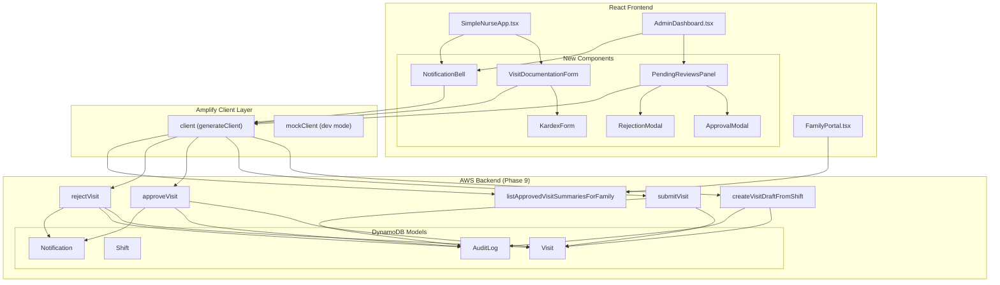
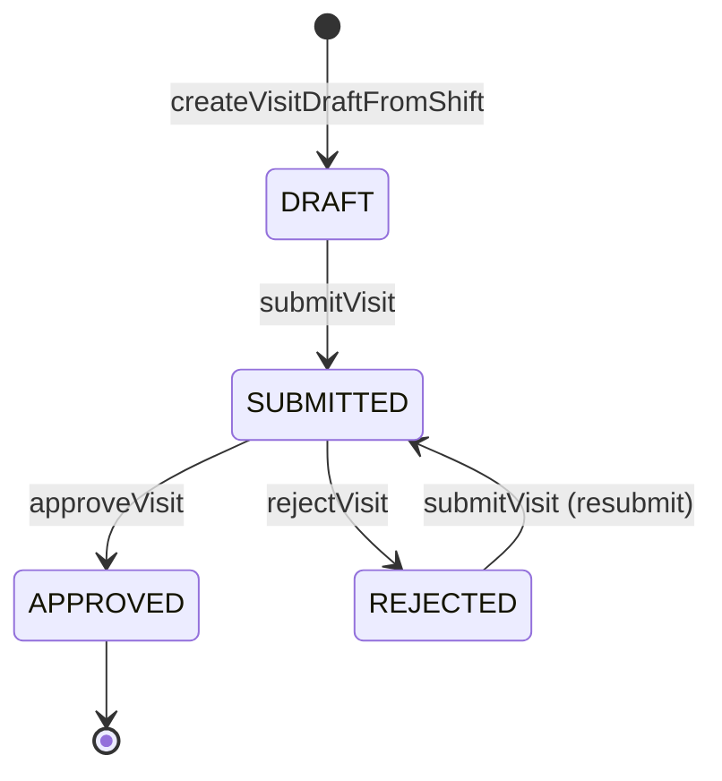

# Design Document: Workflow Compliance Frontend

## Overview

This design document describes the frontend integration for the Visit Workflow Compliance system in the IPS ERP Home Care application. The system connects React components to the Phase 9 backend Lambda functions, enabling nurses to document visits, admins to approve/reject them, and families to view approved summaries.

The design follows the existing patterns established in the codebase:
- Environment-based backend toggle (`VITE_USE_REAL_BACKEND`)
- Amplify Gen 2 client with `generateClient<Schema>()`
- Component-level data fetching with `useState` and `useEffect`
- Role-based UI rendering based on user context

## Architecture



## Components and Interfaces

### 1. VisitDocumentationForm Component

A new component embedded in `SimpleNurseApp.tsx` for documenting visits.

```typescript
interface VisitDocumentationFormProps {
  shiftId: string;
  patientId: string;
  patientName: string;
  onClose: () => void;
  onSubmitSuccess: () => void;
}

interface VisitFormState {
  kardex: KardexData;
  vitals: VitalsData;
  medications: MedicationAdminData[];
  tasks: TaskCompletionData[];
  isSaving: boolean;
  isSubmitting: boolean;
  error: string | null;
}
```

### 2. KardexForm Component

A sub-component for structured clinical documentation.

```typescript
interface KardexFormProps {
  value: KardexData;
  onChange: (kardex: KardexData) => void;
  disabled?: boolean;
}

interface KardexData {
  generalObservations: string;
  skinCondition?: string;
  mobilityStatus?: string;
  nutritionIntake?: string;
  painLevel?: number;
  mentalStatus?: string;
  environmentalSafety?: string;
  caregiverSupport?: string;
  internalNotes?: string;
}
```

### 3. PendingReviewsPanel Component

A new view in `AdminDashboard.tsx` for reviewing submitted visits.

```typescript
interface PendingReviewsPanelProps {
  tenantId: string;
}

interface PendingVisit {
  id: string;
  shiftId: string;
  patientName: string;
  nurseName: string;
  visitDate: string;
  submittedAt: string;
  kardex: KardexData;
  vitals: VitalsData;
  medications: MedicationAdminData[];
  tasks: TaskCompletionData[];
}
```

### 4. ApprovalModal and RejectionModal Components

Modal dialogs for admin actions.

```typescript
interface ApprovalModalProps {
  visit: PendingVisit;
  onConfirm: () => Promise<void>;
  onCancel: () => void;
  isLoading: boolean;
}

interface RejectionModalProps {
  visit: PendingVisit;
  onConfirm: (reason: string) => Promise<void>;
  onCancel: () => void;
  isLoading: boolean;
}
```

### 5. NotificationBell Component

A notification indicator for the header.

```typescript
interface NotificationBellProps {
  userId: string;
}

interface NotificationItem {
  id: string;
  type: 'VISIT_APPROVED' | 'VISIT_REJECTED' | 'VISIT_PENDING_REVIEW';
  message: string;
  entityId: string;
  read: boolean;
  createdAt: string;
}
```

### 6. ApprovedVisitSummary Component

A component for displaying family-safe visit summaries.

```typescript
interface ApprovedVisitSummaryProps {
  summary: VisitSummary;
}

interface VisitSummary {
  visitDate: string;
  nurseName: string;
  duration?: number;
  overallStatus?: string;
  keyActivities?: string[];
  nextVisitDate?: string;
}
```

## Data Models

### Visit State Machine



### Frontend Data Types

```typescript
// Visit status enum matching backend
type VisitStatus = 'DRAFT' | 'SUBMITTED' | 'REJECTED' | 'APPROVED';

// Vitals data structure
interface VitalsData {
  sys: number;
  dia: number;
  spo2: number;
  hr: number;
  temperature?: number;
  weight?: number;
}

// Medication administration record
interface MedicationAdminData {
  medicationName: string;
  intendedDosage: string;
  dosageGiven: string;
  time: string; // ISO datetime
  route?: string;
  notes?: string;
}

// Task completion record
interface TaskCompletionData {
  taskDescription: string;
  completedAt: string; // ISO datetime
  notes?: string;
}

// Full visit record from backend
interface Visit {
  id: string;
  tenantId: string;
  shiftId: string;
  patientId: string;
  nurseId: string;
  status: VisitStatus;
  kardex: KardexData;
  vitalsRecorded?: VitalsData;
  medicationsAdministered?: MedicationAdminData[];
  tasksCompleted?: TaskCompletionData[];
  submittedAt?: string;
  reviewedAt?: string;
  reviewedBy?: string;
  rejectionReason?: string;
  approvedAt?: string;
  approvedBy?: string;
}
```

### GraphQL Operations

```typescript
// Mutations
const createVisitDraft = /* GraphQL */ `
  mutation CreateVisitDraftFromShift($shiftId: ID!) {
    createVisitDraftFromShift(shiftId: $shiftId)
  }
`;

const submitVisit = /* GraphQL */ `
  mutation SubmitVisit($shiftId: ID!) {
    submitVisit(shiftId: $shiftId)
  }
`;

const approveVisit = /* GraphQL */ `
  mutation ApproveVisit($shiftId: ID!) {
    approveVisit(shiftId: $shiftId)
  }
`;

const rejectVisit = /* GraphQL */ `
  mutation RejectVisit($shiftId: ID!, $reason: String!) {
    rejectVisit(shiftId: $shiftId, reason: $reason)
  }
`;

// Queries
const listApprovedVisitSummaries = /* GraphQL */ `
  query ListApprovedVisitSummariesForFamily($patientId: ID!) {
    listApprovedVisitSummariesForFamily(patientId: $patientId) {
      visitDate
      nurseName
      duration
      overallStatus
      keyActivities
      nextVisitDate
    }
  }
`;
```


## Correctness Properties

*A property is a characteristic or behavior that should hold true across all valid executions of a system—essentially, a formal statement about what the system should do. Properties serve as the bridge between human-readable specifications and machine-verifiable correctness guarantees.*

### Property 1: Documentation Button State

*For any* shift displayed in the Nurse Dashboard, if the shift status is COMPLETED and no visit exists for that shift, the button SHALL display "Start Documentation"; if a DRAFT visit exists, the button SHALL display "Continue Documentation"; otherwise no documentation button SHALL be shown.

**Validates: Requirements 1.1, 1.5**

### Property 2: Visit Draft Creation Invocation

*For any* click on "Start Documentation" button, the system SHALL invoke `createVisitDraftFromShift` mutation with exactly the shiftId of the associated shift.

**Validates: Requirements 1.2**

### Property 3: Mutation Success Navigation

*For any* successful `createVisitDraftFromShift` mutation response, the system SHALL navigate to the visit documentation form for that visit.

**Validates: Requirements 1.3**

### Property 4: Mutation Error Display

*For any* failed mutation (createVisitDraftFromShift, submitVisit, approveVisit, rejectVisit), the system SHALL display an error message containing the failure reason from the response.

**Validates: Requirements 1.4, 3.5, 6.5**

### Property 5: Vitals Validation Completeness

*For any* vitals data submitted, if any of the required fields (sys, dia, spo2, hr) are missing or invalid, the validation SHALL reject the submission and highlight the invalid fields.

**Validates: Requirements 2.2, 2.6**

### Property 6: KARDEX Save Preserves Draft Status

*For any* KARDEX save operation on a DRAFT visit, the visit status SHALL remain DRAFT after the save completes.

**Validates: Requirements 2.5**

### Property 7: Submit Button Enablement

*For any* visit documentation form, the "Submit for Review" button SHALL be enabled if and only if all required KARDEX fields are completed.

**Validates: Requirements 3.1**

### Property 8: Submit Mutation Invocation

*For any* click on "Submit for Review" button, the system SHALL invoke `submitVisit` mutation with exactly the shiftId of the associated visit.

**Validates: Requirements 3.2**

### Property 9: Submitted Visit Read-Only Rendering

*For any* visit with status SUBMITTED, the Nurse Dashboard SHALL render the visit as read-only with a "Pending Approval" badge and no edit controls.

**Validates: Requirements 3.4**

### Property 10: Rejected Visit Editable Rendering

*For any* visit with status REJECTED, the Nurse Dashboard SHALL display the rejection reason and enable editing of the KARDEX form.

**Validates: Requirements 3.6**

### Property 11: Notification Type Display

*For any* notification of type VISIT_APPROVED, the system SHALL display a success-styled notification; for type VISIT_REJECTED, the system SHALL display a warning-styled notification with the rejection reason.

**Validates: Requirements 4.2, 4.3**

### Property 12: Notification Click Navigation

*For any* click on a VISIT_REJECTED notification, the system SHALL navigate to the rejected visit's documentation form.

**Validates: Requirements 4.4**

### Property 13: Notification Dismissal

*For any* notification dismissal action, the system SHALL update the notification's `read` field to true.

**Validates: Requirements 4.5**

### Property 14: Pending Reviews Filter

*For any* list of visits displayed in the Admin Dashboard "Pending Reviews" section, all visits SHALL have status SUBMITTED and no other status.

**Validates: Requirements 5.1**

### Property 15: Pending Visit Display Fields

*For any* pending visit displayed in the Admin Dashboard, the rendered output SHALL contain nurse name, patient name, visit date, and submission timestamp.

**Validates: Requirements 5.2**

### Property 16: Pending Visits Sort Order

*For any* list of pending visits, the visits SHALL be sorted by submittedAt timestamp in ascending order (oldest first).

**Validates: Requirements 5.5**

### Property 17: Admin Action Buttons Visibility

*For any* SUBMITTED visit displayed in the Admin Dashboard detail view, both "Approve" and "Reject" buttons SHALL be visible and enabled.

**Validates: Requirements 6.1, 7.1**

### Property 18: Approve Mutation Invocation

*For any* click on "Approve" button, the system SHALL invoke `approveVisit` mutation with exactly the shiftId of the associated visit.

**Validates: Requirements 6.2**

### Property 19: Reject Mutation Invocation

*For any* rejection submission with a non-empty reason, the system SHALL invoke `rejectVisit` mutation with exactly the shiftId and the provided reason.

**Validates: Requirements 7.3**

### Property 20: Rejection Reason Required

*For any* attempt to submit a rejection with an empty or whitespace-only reason, the system SHALL display a validation error and NOT invoke the rejectVisit mutation.

**Validates: Requirements 7.5**

### Property 21: Pending List Update After Admin Action

*For any* successful approveVisit or rejectVisit mutation, the visit SHALL be removed from the pending reviews list.

**Validates: Requirements 6.3, 7.4**

### Property 22: Family Query Invocation

*For any* Family Portal component mount with a selected patient, the system SHALL invoke `listApprovedVisitSummariesForFamily` query with that patient's ID.

**Validates: Requirements 8.1**

### Property 23: Family Visit Summary Display

*For any* visit summary displayed in the Family Portal, the rendered output SHALL contain visitDate, nurseName, and overallStatus (if present).

**Validates: Requirements 8.2**

### Property 24: Family Data Sanitization

*For any* visit summary displayed in the Family Portal, the rendered output SHALL NOT contain raw vitals values, internalNotes from KARDEX, or detailed medication administration records.

**Validates: Requirements 8.3**

### Property 25: Family Visits Sort Order

*For any* list of approved visit summaries in the Family Portal, the visits SHALL be sorted by visitDate in descending order (most recent first).

**Validates: Requirements 8.6**

### Property 26: Backend Toggle Client Selection

*For any* component using the Amplify client, when `VITE_USE_REAL_BACKEND` is true, the component SHALL use `generateClient<Schema>()` for backend calls; when false, it SHALL use the mock client.

**Validates: Requirements 9.1, 9.2**

### Property 27: Loading State Display

*For any* backend call in progress, the component SHALL display a loading indicator until the call completes.

**Validates: Requirements 9.5**

### Property 28: Error Retry Option

*For any* failed backend call, the error display SHALL include a retry button that re-invokes the same operation.

**Validates: Requirements 9.6**

## Error Handling

### Network Errors

- Display user-friendly message: "Unable to connect. Please check your internet connection."
- Provide retry button that re-attempts the failed operation
- Log error details to console for debugging

### Authentication Errors (401/403)

- Redirect to login page with return URL
- Clear any cached authentication state
- Display message: "Your session has expired. Please log in again."

### Validation Errors (400)

- Parse error response for field-specific messages
- Highlight invalid fields in the form
- Display specific error message near the invalid field

### Server Errors (500)

- Display generic message: "Something went wrong. Please try again later."
- Log full error details to console
- Provide retry button

### Mutation Conflict Errors

- For visit state conflicts (e.g., trying to submit already-approved visit):
  - Display specific message explaining the conflict
  - Refresh the visit data to show current state
  - Disable conflicting action buttons

## Testing Strategy

### Unit Tests

Unit tests focus on specific examples and edge cases:

1. **Component Rendering Tests**
   - KardexForm renders all required sections
   - NotificationBell shows correct badge count
   - Empty states render correctly

2. **Validation Tests**
   - Vitals form rejects missing required fields
   - Rejection modal requires non-empty reason
   - KARDEX form validates required observations

3. **Edge Cases**
   - Shift with no patient data
   - Visit with empty medications array
   - Notification list with mixed read/unread

### Property-Based Tests

Property tests verify universal properties across generated inputs. Each test runs minimum 100 iterations.

**Test Configuration:**
- Library: fast-check (TypeScript property-based testing)
- Iterations: 100 minimum per property
- Shrinking: Enabled for failure case minimization

**Property Test Implementation Pattern:**

```typescript
import fc from 'fast-check';

// Feature: workflow-compliance-frontend, Property 14: Pending Reviews Filter
test('pending reviews only show SUBMITTED visits', () => {
  fc.assert(
    fc.property(
      fc.array(arbitraryVisit()),
      (visits) => {
        const pendingVisits = filterPendingReviews(visits);
        return pendingVisits.every(v => v.status === 'SUBMITTED');
      }
    ),
    { numRuns: 100 }
  );
});

// Feature: workflow-compliance-frontend, Property 24: Family Data Sanitization
test('family view never contains sensitive data', () => {
  fc.assert(
    fc.property(
      arbitraryVisitSummary(),
      (summary) => {
        const rendered = renderFamilySummary(summary);
        return !rendered.includes('internalNotes') &&
               !rendered.includes('dosageGiven') &&
               !containsRawVitals(rendered);
      }
    ),
    { numRuns: 100 }
  );
});
```

**Generators (Arbitraries):**

```typescript
const arbitraryVisitStatus = fc.constantFrom('DRAFT', 'SUBMITTED', 'REJECTED', 'APPROVED');

const arbitraryKardex = fc.record({
  generalObservations: fc.string({ minLength: 1 }),
  skinCondition: fc.option(fc.string()),
  mobilityStatus: fc.option(fc.string()),
  painLevel: fc.option(fc.integer({ min: 0, max: 10 })),
  internalNotes: fc.option(fc.string()),
});

const arbitraryVisit = fc.record({
  id: fc.uuid(),
  shiftId: fc.uuid(),
  status: arbitraryVisitStatus,
  kardex: arbitraryKardex,
  submittedAt: fc.option(fc.date().map(d => d.toISOString())),
});

const arbitraryVisitSummary = fc.record({
  visitDate: fc.date().map(d => d.toISOString().split('T')[0]),
  nurseName: fc.string({ minLength: 1 }),
  duration: fc.option(fc.integer({ min: 15, max: 480 })),
  overallStatus: fc.option(fc.string()),
  keyActivities: fc.option(fc.array(fc.string())),
});
```

**Test Coverage by Property:**

| Property | Test Type | Key Assertion |
|----------|-----------|---------------|
| 1 | Property | Button text matches shift/visit state |
| 5 | Property | Incomplete vitals rejected |
| 14 | Property | All pending visits have SUBMITTED status |
| 16 | Property | Visits sorted by submittedAt ascending |
| 20 | Property | Empty reason prevents mutation |
| 24 | Property | No sensitive data in family view |
| 25 | Property | Visits sorted by date descending |
